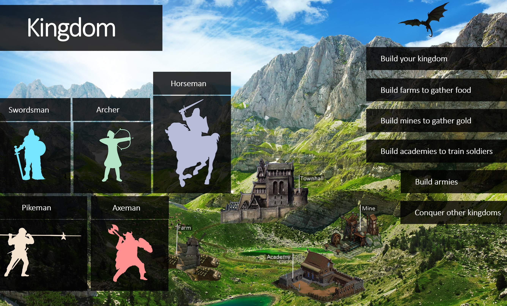
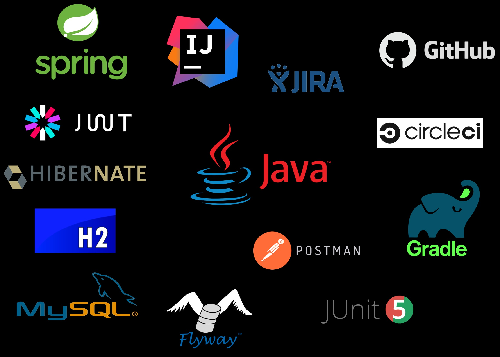
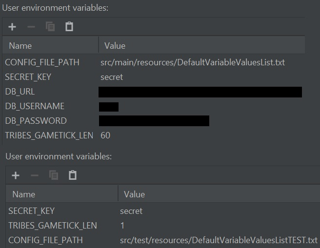

# Kingdom

## Strategy Web Game Back-End Application

### Description
This is a programming bootcamp final phase project. The goal was to create a back-end application for a multiplayer web game based in medieval times.

As a player you register and create your account. You provide a username, name for your Kingdom, and a password to create your account.

Your Kingdom is provided with a Starterpack which includes 4 buildings:
- `townhall` generates food + gold per time, can store a limited amount of food and gold
- `mine` generates gold per time
- `farm` generates food per time
- `troop` eats food per minute

You may build additional buildings to generate more resources over time.
5 types of military units are available for you to build, each with specific advantages and disadvantages.
You may then gather your army and conquer other kingdoms.

## Technologies used in this project

## Environment Variables
To run the application and for running the tests.

